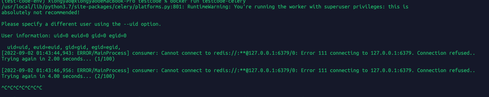
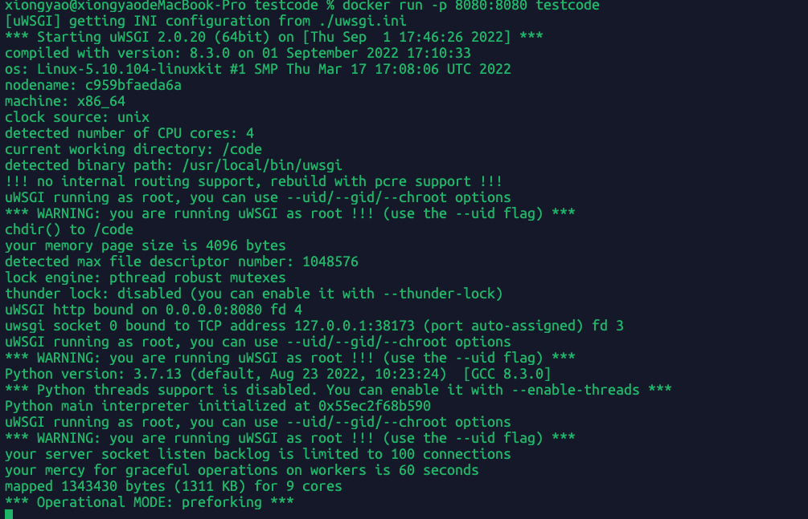
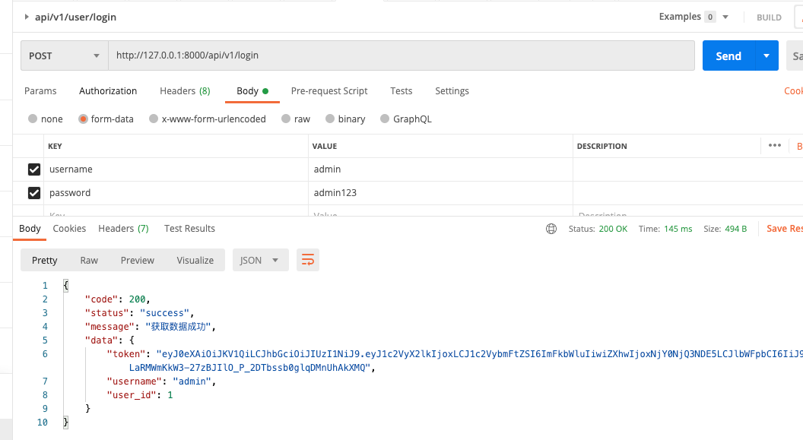
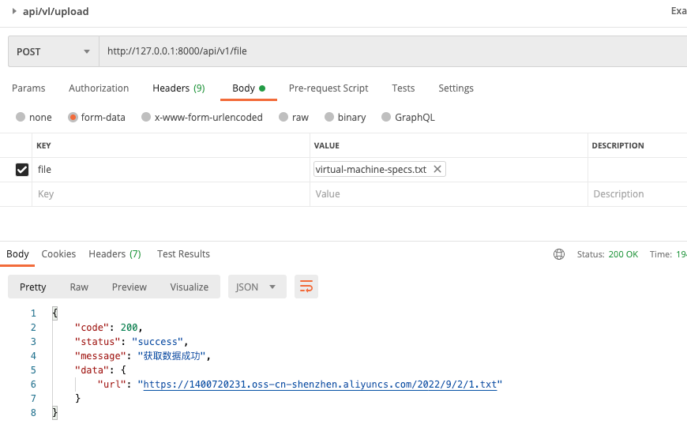
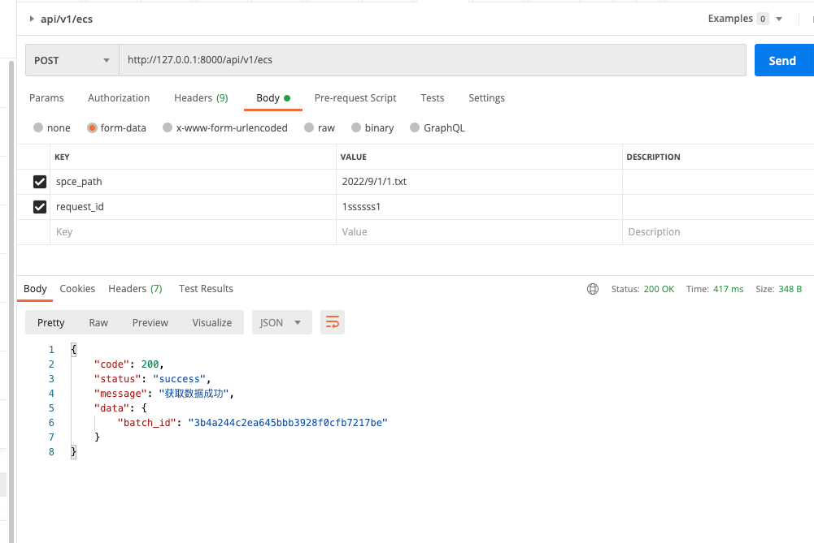
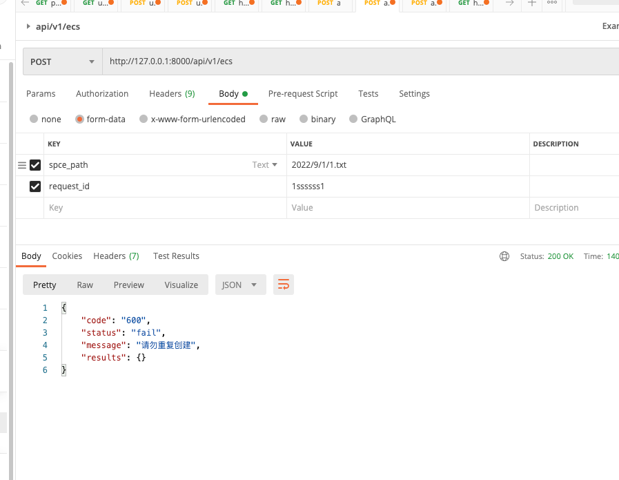

# 1-celery启动

## 1.1-本地启动

```shell

 celery -A testcode worker -l error 

```

>在与manage.py下的同级目录下执行


## 1.2-docker 启动

```shell
docker build -t testcode-celery -f ./CeleryDcokerfile .
docker run testcode-celery 
```
>在与manage.py下的同级目录下执行


>因为代码中有redis使用所以报错是应该的，如果你本地跑自己传环境变量就好

# 2-uwsgi 启动

## 2.1-本地启动

```shell

 python manage.py runserver

```
>在与manage.py下的同级目录下执行  
## 2.2-dokcer启动

```shell
docker build . -t  testcode 
docker run testcode -p 8080:8080
```
>在与manage.py下的同级目录下执行


>django本地docker跑起来是没问题的因为直接用的sqlite


# 3-k8s启动

k8s我没写，是因为时间问题来不及调试。需要注意的是如果你打算在django中使用python manage.py migrate去迁移生成数据库，
那么你可以用k8s的生命周期语法实现在每次docker 启动后执行你的python3 manage.py migrate

```
lifecycle:
  postStart:
    exec:
      command: ["bash", "-c", "python3 manage.py migrate"]
```

# 4-其他说明

```text
1-题目中给的generate_plan函数是操作磁盘的，如果你打算dockerfile启动在容器中操作磁盘就没必要了，所以我直接把原始用户数据上传的配置文件留底到oss。
  所以generate_plan和score_plan实际上没有用到，只是写的业务逻辑大致走向，请不要介意。
2-整体思路我是参考类似去购买阿里云服务器创建成功后会跳转到服务器资源页面等待服务器状态从"创建中.."到"运行中"状态变化这么个过程实现的。所以post /api/v1/ecs
 是一个异步的方法，前端调用后直接返回当前操作的操作id，又因为因为涉及到多个资源创建，所以我用了批次的概念(batch_id)。
3-在post /api/v1/ecs利用redis的原子性操作的分布式锁实现重复请求的拦截，防止创建重复资源，由于时间问题我没有进行全局封装，可优化。
4-所有的dockerfile都需要与需线上的python版本一致，否则会出现各种问题。
5-因为用到了redis所以你本地拉我的代码跑不起来是应该的，因为后面用k8s都是从环境变量中读取，我相信大家是能看懂我的代码意图的。
6-在 post /api/v1/ecs 创建虚拟机资源的接口中，我对上传的文件oss path进行读取，做了伪代码的配置文件规则校验。
7-k8s.yml没写确实是因为没时间，需要调试。

```

# 5-其他截图



>登陆获取jwt



>前端先上传配置文件获取oss 地址



>点击提交上传oss地址，后端从oss读取文件内容创建虚拟机资源



>点击提交创建虚拟机资源重复情况