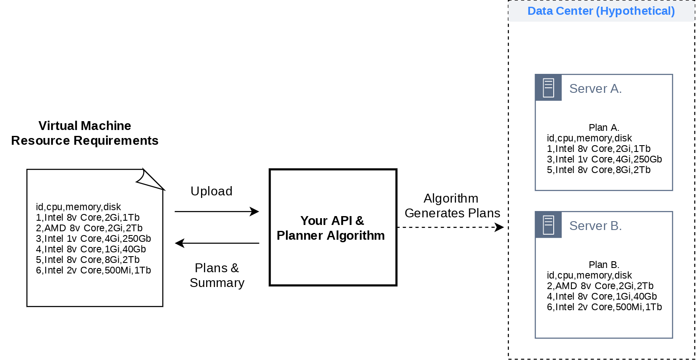

### 任务

请用任何你熟悉的框架实现一个基于Python3的本地服务器。

该服务器提供一个API端口，并实现以下功能：

- 输入：接受用户上传的文本型配置文件
- 返回：按下文介绍的业务需求返回正确的响应体（response body)

请花一点时间仔细阅读下面的任务详情说明。

### 业务背景

这里假设用户通过你的API来管理虚拟机的创建部署过程。 用户将向你发送一份文本配置文件，该文件描述了待创建虚拟机的各项硬件规格，如CPU型号、内存大小、硬盘大小等，每一行表示一个虚拟机实例，如下图所示。

服务器在接收到配置文件后，需要你使用`algorithm.py` 文件中已经提供的功能函数来处理请求，他们分别是：

* `generate_plan`: 这个函数会分析用户上传的虚拟机规格配置文件，然后生成若干份虚拟机分配计划。每份分配计划将安排一部分虚拟机到物理服务器A (server A)，另一部分去物理服务器B (server B)
* `score_plan`: 这个函数对一个具体的虚拟机分配计划进行评分，用来评估这个分配方案是否充分利用了物理机上的硬件资源，分配得当的方案会获得更高的分数

**在试题中，我们虚构了这两个函数的处理过程。你只需要完成函数的集成和调用即可，无需修改或重写algorithm.py中的任何函数**

最终，请返回包含以下信息的**返回体**：

- 得分最高的虚拟机分配计划详情，以及
- 这个分配计划的实际得分（最高分）
- 这个分配计划中，实际分配到server A和server B上各虚拟机的
  - 总CPU核数
  - 总内存数
  - 总硬盘容量

### 注意

* 在上述说明中任何未指定的细节都可以由你自己解释和实现，但请提供适当的实现说明
* 请你设计API请求体/响应体的具体格式（protocol），但请留意`algorithm.py`中功能函数的输入输出格式要求
* 我们提供了一份样例输入文件`virtual-machine-specs.txt`用以开发调试，用户将通过文件上传功能向你的API发送配置文件
* 你的服务器只需要在本地运行，但请提供适当的安装说明、依赖管理和环境初始化工具
* 请使用**英语**书写清晰易懂的docstring和README文件

### 加分项

* 对用户上传的虚拟机规格数据进行校验，并拒绝无效规格文件上传。例如，不正确的数字表示、负数内存值或无法识别的单位等。你可以自由定义什么算是有效的规格数据
* 使用[Celery](https://docs.celeryproject.org/en/stable/getting-started/introduction.html)等任务调度框架来解耦API和功能函数
* 添加身份验证、API 限制、请求重复数据删除、结果缓存等任何你认为在生产环境中应该施加的必要服务
* 以Docker镜像的方式提交你的项目（提供可运行的dockerfile或镜像地址均可）
* 为项目添加一个简单的前端界面（方式不限），实现文件上传的UI操作和返回体的可视化

